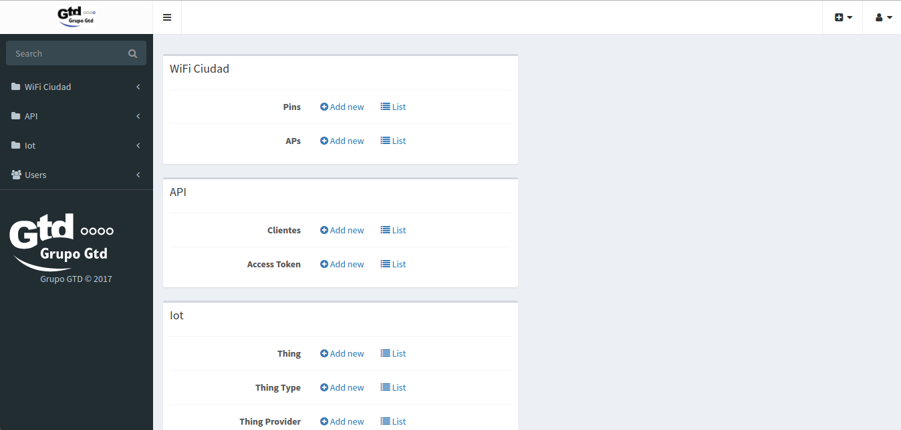

SymfonyCoreGTD
============

SymfonyCoreGTD es una instalación básica de Symfony con los bundles más utilizados para el despliegue de una aplicación Web basado en este Framework. SymfonyCoreGTD está construído bajo la versión 
de Symfony 2.8, pero es aplicable a cualquier versión de Symfony. Previamente, se deberá revisar la compatibilidad de los bundles instalados. Permite el despliegue rápido de aplicaciones Web, bajo
los estandares definidos por la subgerencia de Desarrollo del GrupoGTD.

<br></br>
## Bundles Instalados

- SonataCoreBundle
- SonataBlockBundle
- SonataDoctrineORMAdminBundle
- SonataAdminBundle
- SonataDoctrineMongoDBAdminBundle
- SonataEasyExtendsBundle
- SonataUserBundle
- DoctrineBundle
- DoctrineMongoDBBundle
- KnpMenuBundle
- FOSUserBundle
- ApplicationSonataAdminBundle
- ApplicationSonataUserBundle
- FOSOAuthServerBundle
- SensioFrameworkExtraBundle
- JMSSerializerBundle
- FOSRestBundle


<br></br>
Instalación
=============================

El proceso de instalación está automatizado tanto en la instalación de componentes como en la configuración de estas. Este ambiente de desarrollo está pensado para el Sistema Operativo
CentOS 6.8. La ejecución de la instalación es la siguiente:

### Instalación Básica de Symfony

El proceso realiza lo siguiente:

- Instalación de PostgreSQL 9.4 (Motor de Base de Datos)
- Instalación de Apache (Servidor Web)
- Instalación de PHP56 (Lenguaje de Programación)
- Instalación de Symfony28 (Framework)

```
git clone git@git.grupogtd.com:Desarrollo/SymfonyCore.git
cd SymfonyCore/script_install
chmod a+x install_symfony28.sh
./install_symfony28.sh
```

Se podrá acceder al módulo de administración desde:

- http://localhost/admin
- http://localhost/app.php/admin
- http://localhost/app_dev.php/admin


<br></br>
Wiki
=============================

En esta sección del proyecto se deja disponible la documentación de instalación de todos los componentes del SymfonyCore. Recomendamos usar los script de instalación automática que ahorran el
tiempo de instalación y configuración de cada uno de los bundles.


- [Wiki Proyecto SymfonyCore](https://git.grupogtd.com:8000/Desarrollo/SymfonyCore/wikis/home)


<br></br>
Manuales
=============================

Se adjuntan los principales libros en español relacionados al Framework de Symfony. Se adjunta un manual de Buenas Prácticas para el desarrollo de Software y un libro de comandos básicos de la
consola de Symfony.

- [Desarrollo Ágil de Symfony](https://git.grupogtd.com:8000/Desarrollo/SymfonyCore/blob/master/ebooks/desarrollo-agil-symfony-2.4.pdf)
- [Buenas Prácticas de Symfony](https://git.grupogtd.com:8000/Desarrollo/SymfonyCore/blob/master/ebooks/buenas_practicas_symfony.pdf)
- [Comandos de Consola de Symfony] (https://git.grupogtd.com:8000/Desarrollo/SymfonyCore/blob/master/ebooks/symfony2-console_en_v1-1.pdf)


<br></br>
ScreenCast
===========

- https://knpuniversity.com/screencast/symfony
- https://knpuniversity.com/screencast/phpstorm 


<br></br>
PHP, Métodos y Técnicas de Programación Avanzada
============

- https://gnugat.github.io/2016/06/15/mars-rover-introduction.html

<br></br>
Nginx
========

- https://gnugat.github.io/2016/04/20/super-speed-sf-nginx.html
 

<br></br>
Uso de Máquinas Virtuales
=============================

Máquina virtual administrada vía Vagrant que permite el despliegue rápido del SymfonyCore. Esta basada en la distro de CentOS 6.8 y Symfony28. Se debe tener instalado Vagrant y VirtualBox.

#### Credenciales:

- User: vagrant
- Password: vagrant
- User: root
- Password: vagrant


```
vagrant init jmardoyaz/centos68-symfony28; vagrant up --provider virtualbox
```

<br></br>
ScreenShots
===============

Proyectos construídos con SymfonyCoreGTD:

- API AMO: Api Rest para la Aplicación Móvil para el Aprovisionamiento
- SmartCity: Core de Administración para el Proyecto SmartCity.


